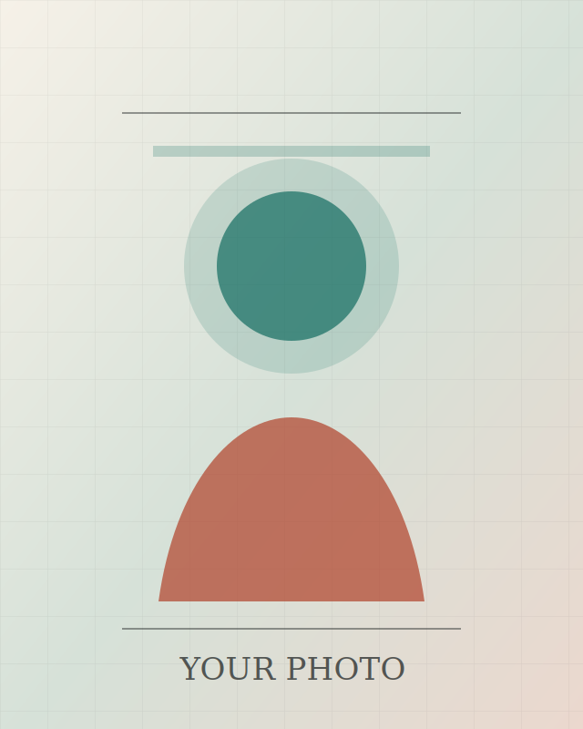

# Personal Profile Homepage

Editable personal profile homepage based on the structure of `https://kangwooklee.com/`: compact identity block, contact links, research/work focus, reports, publications, experience, and contact.

## Files

- `index.html`: profile content and section order.
- `styles.css`: visual system, layout, responsive rules, light/dark colors.
- `script.js`: theme toggle, email copy, publication filter, active navigation.
- `assets/profile-placeholder.svg`: temporary portrait placeholder. Replace this file with your own photo, or update the `` path in `index.html`.

## Edit Points

Open `index.html` and replace these placeholders:

- `[Your Name]`
- `[Current role or headline]`
- `[Affiliation, school, lab, company, or city]`
- `you@example.com`
- GitHub and LinkedIn links
- Focus area cards
- News items
- Tech Reports
- Publications
- Experience

For a real photo, put an image in `assets/`, for example `assets/profile.jpg`, then change:

```html

```

to:

```html

```

To add a CV later, place the PDF in `assets/` and add a contact link in `index.html`.

## Local Preview

This project has no build step. Open `index.html` in a browser, or run a simple local server from this folder:

```powershell
python -m http.server 8080
```

Then open `http://localhost:8080`.

## AGY Modifications (2026-07-08)

The project's CSS (`styles.css`) was refined by AGY to create a more professional, restrained, and scan-friendly academic layout (inspired by minimalist personal academic sites).
Key changes:
- Removed heavily decorative gradients and backgrounds.
- Converted cards and panels to a cleaner CV-style format.
- Improved mobile responsiveness and introduced `@media print` rules for better PDF exports.
- Streamlined typography and spacing to match academic portfolios while maintaining all editable placeholders.
